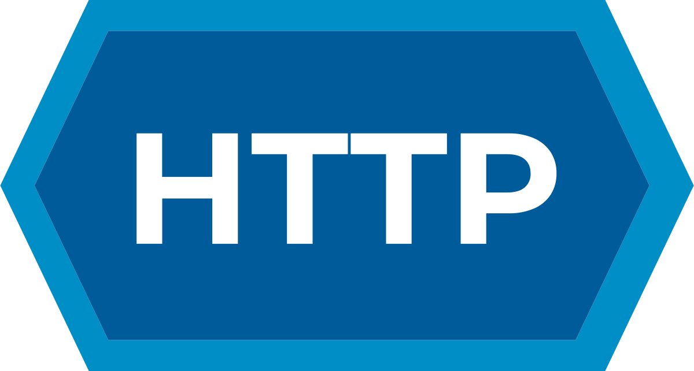

## <p align="center">NoobTTP</p>

[](https://discord.gg/UDNcTrBagN)
[](https://twitter.com/vkxni)
[](https://github.com/alelievr/Mixture/blob/master/LICENSE)

<p align="center">
</a>
<p>

HTTP requests are a crucial part of any web application. They are used to communicate with other servers and fetch data from them. But isn't it a pain to write the same code for making HTTP requests over and over again? Well, not anymore. With NoobTTP, you can make nooby HTTP requests with just a few lines of code.

It is a simple and easy-to-use library that makes HTTP requests a breeze. A wrapper around the popular Axios library.

---

Example

```ts
import { RequestHandler, HttpMethod, DebugLevel } from "noobttp";

const handler = new RequestHandler({
  url: "https://jsonplaceholder.typicode.com/todos/",
  headers: {
    "Content-Type": "application/json",
  },
  mode: HttpMethod.GET,
  debug: DebugLevel.SOFT,
  responseType: "json",
  maxContentLength: 100_000,
  timeout: 10_000,
  maxBodyLength: 10_000,
  validateStatus: (status: number) => status >= 200 && status < 400,
  withCredentials: true, // if you want to send cookies
});

// Send the request and log the response
handler
  .sendRequest()
  .then((response: any) => {
    console.log(response.data);
  })
  .catch((error: any) => {
    console.error(error.message);
  });
```

---

## Functions

`url` - The URL to which the request is to be sent.

`headers` - The headers to be sent with the request in the form of a key-value pair.

`mode` - The HTTP method to be used for the request.

`apiKey` - The API key to be sent with the request (for protected endpoints)

`debug` - The debug level to be used for the request. It can be either `DebugLevel.NONE`, `DebugLevel.SOFT` or `DebugLevel.HARD`.

`responseType` - The type of response to be expected. It can be either `arraybuffer`, `blob`, `document`, `json`, `text`, `stream`.

`maxContentLength` - The maximum content length of the response.

`maxBodyLength` - The maximum body length of the response.

`timeout` - The timeout for the request in milliseconds.

`validateStatus` - The function to be used to validate the status code of the response (200 - 399 = success)

`withCredentials` - Whether or not to send cookies with the request.

---

### Debugging

Example output for `DebugLevel.SOFT`

```
Sending request to https://jsonplaceholder.typicode.com/todos/
```

Example output for `DebugLevel.MEDIUM` (**RECOMMENDED**)

Basic RequestHandler informations

```
Sending request to https://jsonplaceholder.typicode.com/todos/
[RequestHandler] Interceptor: Received response from https://jsonplaceholder.typicode.com/todos/: {
  status: 200,
  statusText: 'OK',
  headers: AxiosHeaders {
    date: 'Sat, 13 May 2023 18:09:53 GMT',
    'content-type': 'application/json; charset=utf-8',
    'transfer-encoding': 'chunked',
    connection: 'close',
    'x-powered-by': 'Express',
    'x-ratelimit-limit': '1000',
    'x-ratelimit-remaining': '999',
    'x-ratelimit-reset': '1683998037',
    vary: 'Origin, Accept-Encoding',
    'access-control-allow-credentials': 'true',
    'cache-control': 'max-age=43200',
    pragma: 'no-cache',
    expires: '-1',
    'x-content-type-options': 'nosniff',
    etag: 'W/"5ef7-4Ad6/n39KWY9q6Ykm/ULNQ2F5IM"',
    via: '1.1 vegur',
    'cf-cache-status': 'HIT',
    age: '3415',
    'report-to': '{"endpoints":[{"url":"https:\\/\\/a.nel.cloudflare.com\\/report\\/v3?s=TEMaD9PX%2B1FnmOPLfHQI3OwPu0g6IfLU6gjTW9TzdzSgRyhQsTU3r0rkBqjCxDMKizfOt4gBf%2FwY8Awy7QSKP%2FwgLqwgTwQLomL%2BtumzFcVUYh1eDnibzMj1pUxNYt%2BmX8cJXHVL3xx%2FA3p2xH3k"}],"group":"cf-nel","max_age":604800}',
    nel: '{"success_fraction":0,"report_to":"cf-nel","max_age":604800}',
    server: 'cloudflare',
    'cf-ray': '7c6cdae66be678b5-VIE',
    'alt-svc': 'h3=":443"; ma=86400, h3-29=":443"; ma=86400'
  },
  config: {
    transitional: {
      silentJSONParsing: true,
      forcedJSONParsing: true,
      clarifyTimeoutError: false
    },
    adapter: [ 'xhr', 'http' ],
    transformRequest: [ [Function: transformRequest] ],
    transformResponse: [ [Function: transformResponse] ],
    timeout: 10000,
    xsrfCookieName: 'XSRF-TOKEN',
    xsrfHeaderName: 'X-XSRF-TOKEN',
    maxContentLength: 100000,
    maxBodyLength: 10000,
    env: { FormData: [Function], Blob: null },
    validateStatus: [Function: validateStatus],
    headers: AxiosHeaders {
      Accept: 'application/json, text/plain, */*',
      'Content-Type': 'application/json',
      'User-Agent': 'axios/1.4.0',
      'Accept-Encoding': 'gzip, compress, deflate, br'
    },
    params: {},
    responseType: 'json',
    withCredentials: true,
    url: 'https://jsonplaceholder.typicode.com/todos/',
    method: 'get',
    data: undefined
  },
  request: <ref *1> ClientRequest {
    _events: [Object: null prototype] {
      abort: [Function (anonymous)],
      aborted: [Function (anonymous)],
      connect: [Function (anonymous)],
      error: [Function (anonymous)],
      socket: [Function (anonymous)],
      timeout: [Function (anonymous)],
      prefinish: [Function: requestOnPrefinish]
    },
    _eventsCount: 7,
    _maxListeners: undefined,
    outputData: [],
    outputSize: 0,
    writable: true,
    destroyed: true,
    _last: true,
    chunkedEncoding: false,
    shouldKeepAlive: false,
    maxRequestsOnConnectionReached: false,
    _defaultKeepAlive: true,
    useChunkedEncodingByDefault: false,
    sendDate: false,
    _removedConnection: false,
    _removedContLen: false,
    _removedTE: false,
    _contentLength: 0,
    _hasBody: true,
    _trailer: '',
    finished: true,
    _headerSent: true,
    _closed: true,
    socket: TLSSocket {
      _tlsOptions: [Object],
      _secureEstablished: true,
      _securePending: false,
      _newSessionPending: false,
      _controlReleased: true,
      secureConnecting: false,
      _SNICallback: null,
      servername: 'jsonplaceholder.typicode.com',
      alpnProtocol: false,
      authorized: true,
      authorizationError: null,
      encrypted: true,
      _events: [Object: null prototype],
      _eventsCount: 9,
      connecting: false,
      _hadError: false,
      _parent: null,
      _host: 'jsonplaceholder.typicode.com',
      _readableState: [ReadableState],
      _maxListeners: undefined,
      _writableState: [WritableState],
      allowHalfOpen: false,
      _sockname: null,
      _pendingData: null,
      _pendingEncoding: '',
      server: undefined,
      _server: null,
      ssl: null,
      _requestCert: true,
      _rejectUnauthorized: true,
      parser: null,
      _httpMessage: [Circular *1],
      timeout: 10000,
      write: [Function: writeAfterFIN],
      [Symbol(res)]: null,
      [Symbol(verified)]: true,
      [Symbol(pendingSession)]: null,
      [Symbol(async_id_symbol)]: 6,
      [Symbol(kHandle)]: null,
      [Symbol(lastWriteQueueSize)]: 0,
      [Symbol(timeout)]: Timeout {
        _idleTimeout: -1,
        _idlePrev: null,
        _idleNext: null,
        _idleStart: 201,
        _onTimeout: null,
        _timerArgs: undefined,
        _repeat: null,
        _destroyed: true,
        [Symbol(refed)]: false,
        [Symbol(kHasPrimitive)]: false,
        [Symbol(asyncId)]: 15,
        [Symbol(triggerId)]: 10
      },
      [Symbol(kBuffer)]: null,
      [Symbol(kBufferCb)]: null,
      [Symbol(kBufferGen)]: null,
      [Symbol(kCapture)]: false,
      [Symbol(kSetNoDelay)]: false,
      [Symbol(kSetKeepAlive)]: true,
      [Symbol(kSetKeepAliveInitialDelay)]: 60,
      [Symbol(kBytesRead)]: 5040,
      [Symbol(kBytesWritten)]: 225,
      [Symbol(connect-options)]: [Object],
      [Symbol(RequestTimeout)]: undefined
    },
    _header: 'GET /todos/ HTTP/1.1\r\n' +
      'Accept: application/json, text/plain, */*\r\n' +
      'Content-Type: application/json\r\n' +
      'User-Agent: axios/1.4.0\r\n' +
      'Accept-Encoding: gzip, compress, deflate, br\r\n' +
      'Host: jsonplaceholder.typicode.com\r\n' +
      'Connection: close\r\n' +
      '\r\n',
    _keepAliveTimeout: 0,
    _onPendingData: [Function: nop],
    agent: Agent {
      _events: [Object: null prototype],
      _eventsCount: 2,
      _maxListeners: undefined,
      defaultPort: 443,
      protocol: 'https:',
      options: [Object: null prototype],
      requests: [Object: null prototype] {},
      sockets: [Object: null prototype] {},
      freeSockets: [Object: null prototype] {},
      keepAliveMsecs: 1000,
      keepAlive: false,
      maxSockets: Infinity,
      maxFreeSockets: 256,
      scheduling: 'lifo',
      maxTotalSockets: Infinity,
      totalSocketCount: 0,
      maxCachedSessions: 100,
      _sessionCache: [Object],
      [Symbol(kCapture)]: false
    },
    socketPath: undefined,
    method: 'GET',
    maxHeaderSize: undefined,
    insecureHTTPParser: undefined,
    path: '/todos/',
    _ended: true,
    res: IncomingMessage {
      _readableState: [ReadableState],
      _events: [Object: null prototype],
      _eventsCount: 4,
      _maxListeners: undefined,
      socket: [TLSSocket],
      httpVersionMajor: 1,
      httpVersionMinor: 1,
      httpVersion: '1.1',
      complete: true,
      rawHeaders: [Array],
      rawTrailers: [],
      aborted: false,
      upgrade: false,
      url: '',
      method: null,
      statusCode: 200,
      statusMessage: 'OK',
      client: [TLSSocket],
      _consuming: true,
      _dumped: false,
      req: [Circular *1],
      responseUrl: 'https://jsonplaceholder.typicode.com/todos/',
      redirects: [],
      [Symbol(kCapture)]: false,
      [Symbol(kHeaders)]: [Object],
      [Symbol(kHeadersCount)]: 48,
      [Symbol(kTrailers)]: null,
      [Symbol(kTrailersCount)]: 0,
      [Symbol(RequestTimeout)]: undefined
    },
    aborted: false,
    timeoutCb: null,
    upgradeOrConnect: false,
    parser: null,
    maxHeadersCount: null,
    reusedSocket: false,
    host: 'jsonplaceholder.typicode.com',
    protocol: 'https:',
    _redirectable: Writable {
      _writableState: [WritableState],
      _events: [Object: null prototype],
      _eventsCount: 3,
      _maxListeners: undefined,
      _options: [Object],
      _ended: true,
      _ending: true,
      _redirectCount: 0,
      _redirects: [],
      _requestBodyLength: 0,
      _requestBodyBuffers: [],
      _onNativeResponse: [Function (anonymous)],
      _currentRequest: [Circular *1],
      _currentUrl: 'https://jsonplaceholder.typicode.com/todos/',
      _timeout: null,
      [Symbol(kCapture)]: false
    },
    [Symbol(kCapture)]: false,
    [Symbol(kNeedDrain)]: false,
    [Symbol(corked)]: 0,
    [Symbol(kOutHeaders)]: [Object: null prototype] {
      accept: [Array],
      'content-type': [Array],
      'user-agent': [Array],
      'accept-encoding': [Array],
      host: [Array]
    }
  },
```

Example output for `DebugLevel.HARD` (**ADVANCED**)

(RequestHandler + RequestHandler Interceptor) with detailed reponse and request information

```
Sending request to https://jsonplaceholder.typicode.com/todos/
[RequestHandler] Interceptor: Received response from https://jsonplaceholder.typicode.com/todos/: {
  status: 200,
  statusText: 'OK',
  headers: AxiosHeaders {
    date: 'Sat, 13 May 2023 18:13:02 GMT',
    'content-type': 'application/json; charset=utf-8',
    'transfer-encoding': 'chunked',
    connection: 'close',
    'x-powered-by': 'Express',
    'x-ratelimit-limit': '1000',
    'x-ratelimit-remaining': '999',
    'x-ratelimit-reset': '1683998037',
    vary: 'Origin, Accept-Encoding',
    'access-control-allow-credentials': 'true',
    'cache-control': 'max-age=43200',
    pragma: 'no-cache',
    expires: '-1',
    'x-content-type-options': 'nosniff',
    etag: 'W/"5ef7-4Ad6/n39KWY9q6Ykm/ULNQ2F5IM"',
    via: '1.1 vegur',
    'cf-cache-status': 'HIT',
    age: '3604',
    'report-to': '{"endpoints":[{"url":"https:\\/\\/a.nel.cloudflare.com\\/report\\/v3?s=0VDygf50gld%2Fq7ygm9ONrmVjJQEi3ehLPH1DgFBzLkJE9%2F15hF%2FsAUEHIP86ISezh2%2F3QAH7wpvbs9LL1jHud6MFouvQ5yi6Li8o0G7CTsOQZ2KHfs9ZZPwTdhlKEU1V5DMS2CTQ7kmLDGHbrHvc"}],"group":"cf-nel","max_age":604800}',
    nel: '{"success_fraction":0,"report_to":"cf-nel","max_age":604800}',
    server: 'cloudflare',
    'cf-ray': '7c6cdf818cd2c2d9-VIE',
    'alt-svc': 'h3=":443"; ma=86400, h3-29=":443"; ma=86400'
  },
  config: {
    transitional: {
      silentJSONParsing: true,
      forcedJSONParsing: true,
      clarifyTimeoutError: false
    },
    adapter: [ 'xhr', 'http' ],
    transformRequest: [ [Function: transformRequest] ],
    transformResponse: [ [Function: transformResponse] ],
    timeout: 10000,
    xsrfCookieName: 'XSRF-TOKEN',
    xsrfHeaderName: 'X-XSRF-TOKEN',
    maxContentLength: 100000,
    maxBodyLength: 10000,
    env: { FormData: [Function], Blob: null },
    validateStatus: [Function: validateStatus],
    headers: AxiosHeaders {
      Accept: 'application/json, text/plain, */*',
      'Content-Type': 'application/json',
      'User-Agent': 'axios/1.4.0',
      'Accept-Encoding': 'gzip, compress, deflate, br'
    },
    params: {},
    responseType: 'json',
    withCredentials: true,
    url: 'https://jsonplaceholder.typicode.com/todos/',
    method: 'get',
    data: undefined
  },
  request: <ref *1> ClientRequest {
    _events: [Object: null prototype] {
      abort: [Function (anonymous)],
      aborted: [Function (anonymous)],
      connect: [Function (anonymous)],
      error: [Function (anonymous)],
      socket: [Function (anonymous)],
      timeout: [Function (anonymous)],
      prefinish: [Function: requestOnPrefinish]
    },
    _eventsCount: 7,
    _maxListeners: undefined,
    outputData: [],
    outputSize: 0,
    writable: true,
    destroyed: true,
    _last: true,
    chunkedEncoding: false,
    shouldKeepAlive: false,
    maxRequestsOnConnectionReached: false,
    _defaultKeepAlive: true,
    useChunkedEncodingByDefault: false,
    sendDate: false,
    _removedConnection: false,
    _removedContLen: false,
    _removedTE: false,
    _contentLength: 0,
    _hasBody: true,
    _trailer: '',
    finished: true,
    _headerSent: true,
    _closed: true,
    socket: TLSSocket {
      _tlsOptions: [Object],
      _secureEstablished: true,
      _securePending: false,
      _newSessionPending: false,
      _controlReleased: true,
      secureConnecting: false,
      _SNICallback: null,
      servername: 'jsonplaceholder.typicode.com',
      alpnProtocol: false,
      authorized: true,
      authorizationError: null,
      encrypted: true,
      _events: [Object: null prototype],
      _eventsCount: 9,
      connecting: false,
      _hadError: false,
      _parent: null,
      _host: 'jsonplaceholder.typicode.com',
      _readableState: [ReadableState],
      _maxListeners: undefined,
      _writableState: [WritableState],
      allowHalfOpen: false,
      _sockname: null,
      _pendingData: null,
      _pendingEncoding: '',
      server: undefined,
      _server: null,
      ssl: null,
      _requestCert: true,
      _rejectUnauthorized: true,
      parser: null,
      _httpMessage: [Circular *1],
      timeout: 10000,
      write: [Function: writeAfterFIN],
      [Symbol(res)]: null,
      [Symbol(verified)]: true,
      [Symbol(pendingSession)]: null,
      [Symbol(async_id_symbol)]: 6,
      [Symbol(kHandle)]: null,
      [Symbol(lastWriteQueueSize)]: 0,
      [Symbol(timeout)]: Timeout {
        _idleTimeout: -1,
        _idlePrev: null,
        _idleNext: null,
        _idleStart: 169,
        _onTimeout: null,
        _timerArgs: undefined,
        _repeat: null,
        _destroyed: true,
        [Symbol(refed)]: false,
        [Symbol(kHasPrimitive)]: false,
        [Symbol(asyncId)]: 15,
        [Symbol(triggerId)]: 10
      },
      [Symbol(kBuffer)]: null,
      [Symbol(kBufferCb)]: null,
      [Symbol(kBufferGen)]: null,
      [Symbol(kCapture)]: false,
      [Symbol(kSetNoDelay)]: false,
      [Symbol(kSetKeepAlive)]: true,
      [Symbol(kSetKeepAliveInitialDelay)]: 60,
      [Symbol(kBytesRead)]: 5036,
      [Symbol(kBytesWritten)]: 225,
      [Symbol(connect-options)]: [Object],
      [Symbol(RequestTimeout)]: undefined
    },
    _header: 'GET /todos/ HTTP/1.1\r\n' +
      'Accept: application/json, text/plain, */*\r\n' +
      'Content-Type: application/json\r\n' +
      'User-Agent: axios/1.4.0\r\n' +
      'Accept-Encoding: gzip, compress, deflate, br\r\n' +
      'Host: jsonplaceholder.typicode.com\r\n' +
      'Connection: close\r\n' +
      '\r\n',
    _keepAliveTimeout: 0,
    _onPendingData: [Function: nop],
    agent: Agent {
      _events: [Object: null prototype],
      _eventsCount: 2,
      _maxListeners: undefined,
      defaultPort: 443,
      protocol: 'https:',
      options: [Object: null prototype],
      requests: [Object: null prototype] {},
      sockets: [Object: null prototype] {},
      freeSockets: [Object: null prototype] {},
      keepAliveMsecs: 1000,
      keepAlive: false,
      maxSockets: Infinity,
      maxFreeSockets: 256,
      scheduling: 'lifo',
      maxTotalSockets: Infinity,
      totalSocketCount: 0,
      maxCachedSessions: 100,
      _sessionCache: [Object],
      [Symbol(kCapture)]: false
    },
    socketPath: undefined,
    method: 'GET',
    maxHeaderSize: undefined,
    insecureHTTPParser: undefined,
    path: '/todos/',
    _ended: true,
    res: IncomingMessage {
      _readableState: [ReadableState],
      _events: [Object: null prototype],
      _eventsCount: 4,
      _maxListeners: undefined,
      socket: [TLSSocket],
      httpVersionMajor: 1,
      httpVersionMinor: 1,
      httpVersion: '1.1',
      complete: true,
      rawHeaders: [Array],
      rawTrailers: [],
      aborted: false,
      upgrade: false,
      url: '',
      method: null,
      statusCode: 200,
      statusMessage: 'OK',
      client: [TLSSocket],
      _consuming: true,
      _dumped: false,
      req: [Circular *1],
      responseUrl: 'https://jsonplaceholder.typicode.com/todos/',
      redirects: [],
      [Symbol(kCapture)]: false,
      [Symbol(kHeaders)]: [Object],
      [Symbol(kHeadersCount)]: 48,
      [Symbol(kTrailers)]: null,
      [Symbol(kTrailersCount)]: 0,
      [Symbol(RequestTimeout)]: undefined
    },
    aborted: false,
    timeoutCb: null,
    upgradeOrConnect: false,
    parser: null,
    maxHeadersCount: null,
    reusedSocket: false,
    host: 'jsonplaceholder.typicode.com',
    protocol: 'https:',
    _redirectable: Writable {
      _writableState: [WritableState],
      _events: [Object: null prototype],
      _eventsCount: 3,
      _maxListeners: undefined,
      _options: [Object],
      _ended: true,
      _ending: true,
      _redirectCount: 0,
      _redirects: [],
      _requestBodyLength: 0,
      _requestBodyBuffers: [],
      _onNativeResponse: [Function (anonymous)],
      _currentRequest: [Circular *1],
      _currentUrl: 'https://jsonplaceholder.typicode.com/todos/',
      _timeout: null,
      [Symbol(kCapture)]: false
    },
    [Symbol(kCapture)]: false,
    [Symbol(kNeedDrain)]: false,
    [Symbol(corked)]: 0,
    [Symbol(kOutHeaders)]: [Object: null prototype] {
      accept: [Array],
      'content-type': [Array],
      'user-agent': [Array],
      'accept-encoding': [Array],
      host: [Array]
    }
  },

// data here from api request

[RequestHandler] Received response from https://jsonplaceholder.typicode.com/todos/: {
  status: 200,
  statusText: 'OK',
  headers: AxiosHeaders {
    date: 'Sat, 13 May 2023 18:11:00 GMT',
    'content-type': 'application/json; charset=utf-8',
    'transfer-encoding': 'chunked',
    connection: 'close',
    'x-powered-by': 'Express',
    'x-ratelimit-limit': '1000',
    'x-ratelimit-remaining': '999',
    'x-ratelimit-reset': '1683998037',
    vary: 'Origin, Accept-Encoding',
    'access-control-allow-credentials': 'true',
    'cache-control': 'max-age=43200',
    pragma: 'no-cache',
    expires: '-1',
    'x-content-type-options': 'nosniff',
    etag: 'W/"5ef7-4Ad6/n39KWY9q6Ykm/ULNQ2F5IM"',
    via: '1.1 vegur',
    'cf-cache-status': 'HIT',
    age: '3482',
    'report-to': '{"endpoints":[{"url":"https:\\/\\/a.nel.cloudflare.com\\/report\\/v3?s=1o7gBNV6HWq7ay8KBl96g6o3z1CI73oEgrKRkdyYsy0K%2BhtGhWo22zz9wmn8oziG%2FDjUEj19WDSlQkEyK3CVS%2F7rBrtBDw6KpDaRhHq0hCp%2FnHTV6CGOTM4n7zlf8rpLv3NcBVsbjbItc%2FK1k5Aq"}],"group":"cf-nel","max_age":604800}',
    nel: '{"success_fraction":0,"report_to":"cf-nel","max_age":604800}',
    server: 'cloudflare',
    'cf-ray': '7c6cdc85fb04324d-VIE',
    'alt-svc': 'h3=":443"; ma=86400, h3-29=":443"; ma=86400'
  },
  config: {
    transitional: {
      silentJSONParsing: true,
      forcedJSONParsing: true,
      clarifyTimeoutError: false
    },
    adapter: [ 'xhr', 'http' ],
    transformRequest: [ [Function: transformRequest] ],
    transformResponse: [ [Function: transformResponse] ],
    timeout: 10000,
    xsrfCookieName: 'XSRF-TOKEN',
    xsrfHeaderName: 'X-XSRF-TOKEN',
    maxContentLength: 100000,
    maxBodyLength: 10000,
    env: { FormData: [Function], Blob: null },
    validateStatus: [Function: validateStatus],
    headers: AxiosHeaders {
      Accept: 'application/json, text/plain, */*',
      'Content-Type': 'application/json',
      'User-Agent': 'axios/1.4.0',
      'Accept-Encoding': 'gzip, compress, deflate, br'
    },
    params: {},
    responseType: 'json',
    withCredentials: true,
    url: 'https://jsonplaceholder.typicode.com/todos/',
    method: 'get',
    data: undefined
  },
  request: <ref *1> ClientRequest {
    _events: [Object: null prototype] {
      abort: [Function (anonymous)],
      aborted: [Function (anonymous)],
      connect: [Function (anonymous)],
      error: [Function (anonymous)],
      socket: [Function (anonymous)],
      timeout: [Function (anonymous)],
      prefinish: [Function: requestOnPrefinish]
    },
    _eventsCount: 7,
    _maxListeners: undefined,
    outputData: [],
    outputSize: 0,
    writable: true,
    destroyed: true,
    _last: true,
    chunkedEncoding: false,
    shouldKeepAlive: false,
    maxRequestsOnConnectionReached: false,
    _defaultKeepAlive: true,
    useChunkedEncodingByDefault: false,
    sendDate: false,
    _removedConnection: false,
    _removedContLen: false,
    _removedTE: false,
    _contentLength: 0,
    _hasBody: true,
    _trailer: '',
    finished: true,
    _headerSent: true,
    _closed: true,
    socket: TLSSocket {
      _tlsOptions: [Object],
      _secureEstablished: true,
      _securePending: false,
      _newSessionPending: false,
      _controlReleased: true,
      secureConnecting: false,
      _SNICallback: null,
      servername: 'jsonplaceholder.typicode.com',
      alpnProtocol: false,
      authorized: true,
      authorizationError: null,
      encrypted: true,
      _events: [Object: null prototype],
      _eventsCount: 9,
      connecting: false,
      _hadError: false,
      _parent: null,
      _host: 'jsonplaceholder.typicode.com',
      _readableState: [ReadableState],
      _maxListeners: undefined,
      _writableState: [WritableState],
      allowHalfOpen: false,
      _sockname: null,
      _pendingData: null,
      _pendingEncoding: '',
      server: undefined,
      _server: null,
      ssl: null,
      _requestCert: true,
      _rejectUnauthorized: true,
      parser: null,
      _httpMessage: [Circular *1],
      timeout: 10000,
      [Symbol(res)]: null,
      [Symbol(verified)]: true,
      [Symbol(pendingSession)]: null,
      [Symbol(async_id_symbol)]: 6,
      [Symbol(kHandle)]: null,
      [Symbol(lastWriteQueueSize)]: 0,
      [Symbol(timeout)]: Timeout {
        _idleTimeout: -1,
        _idlePrev: null,
        _idleNext: null,
        _idleStart: 215,
        _onTimeout: null,
        _timerArgs: undefined,
        _repeat: null,
        _destroyed: true,
        [Symbol(refed)]: false,
        [Symbol(kHasPrimitive)]: false,
        [Symbol(asyncId)]: 15,
        [Symbol(triggerId)]: 10
      },
      [Symbol(kBuffer)]: null,
      [Symbol(kBufferCb)]: null,
      [Symbol(kBufferGen)]: null,
      [Symbol(kCapture)]: false,
      [Symbol(kSetNoDelay)]: false,
      [Symbol(kSetKeepAlive)]: true,
      [Symbol(kSetKeepAliveInitialDelay)]: 60,
      [Symbol(kBytesRead)]: 5038,
      [Symbol(kBytesWritten)]: 225,
      [Symbol(connect-options)]: [Object],
      [Symbol(RequestTimeout)]: undefined
    },
    _header: 'GET /todos/ HTTP/1.1\r\n' +
      'Accept: application/json, text/plain, */*\r\n' +
      'Content-Type: application/json\r\n' +
      'User-Agent: axios/1.4.0\r\n' +
      'Accept-Encoding: gzip, compress, deflate, br\r\n' +
      'Host: jsonplaceholder.typicode.com\r\n' +
      'Connection: close\r\n' +
      '\r\n',
    _keepAliveTimeout: 0,
    _onPendingData: [Function: nop],
    agent: Agent {
      _events: [Object: null prototype],
      _eventsCount: 2,
      _maxListeners: undefined,
      defaultPort: 443,
      protocol: 'https:',
      options: [Object: null prototype],
      requests: [Object: null prototype] {},
      sockets: [Object: null prototype] {},
      freeSockets: [Object: null prototype] {},
      keepAliveMsecs: 1000,
      keepAlive: false,
      maxSockets: Infinity,
      maxFreeSockets: 256,
      scheduling: 'lifo',
      maxTotalSockets: Infinity,
      totalSocketCount: 0,
      maxCachedSessions: 100,
      _sessionCache: [Object],
      [Symbol(kCapture)]: false
    },
    socketPath: undefined,
    method: 'GET',
    maxHeaderSize: undefined,
    insecureHTTPParser: undefined,
    path: '/todos/',
    _ended: true,
    res: IncomingMessage {
      _readableState: [ReadableState],
      _events: [Object: null prototype],
      _eventsCount: 4,
      _maxListeners: undefined,
      socket: [TLSSocket],
      httpVersionMajor: 1,
      httpVersionMinor: 1,
      httpVersion: '1.1',
      complete: true,
      rawHeaders: [Array],
      rawTrailers: [],
      aborted: false,
      upgrade: false,
      url: '',
      method: null,
      statusCode: 200,
      statusMessage: 'OK',
      client: [TLSSocket],
      _consuming: true,
      _dumped: false,
      req: [Circular *1],
      responseUrl: 'https://jsonplaceholder.typicode.com/todos/',
      redirects: [],
      [Symbol(kCapture)]: false,
      [Symbol(kHeaders)]: [Object],
      [Symbol(kHeadersCount)]: 48,
      [Symbol(kTrailers)]: null,
      [Symbol(kTrailersCount)]: 0,
      [Symbol(RequestTimeout)]: undefined
    },
    aborted: false,
    timeoutCb: null,
    upgradeOrConnect: false,
    parser: null,
    maxHeadersCount: null,
    reusedSocket: false,
    host: 'jsonplaceholder.typicode.com',
    protocol: 'https:',
    _redirectable: Writable {
      _writableState: [WritableState],
      _events: [Object: null prototype],
      _eventsCount: 3,
      _maxListeners: undefined,
      _options: [Object],
      _ended: true,
      _ending: true,
      _redirectCount: 0,
      _redirects: [],
      _requestBodyLength: 0,
      _requestBodyBuffers: [],
      _onNativeResponse: [Function (anonymous)],
      _currentRequest: [Circular *1],
      _currentUrl: 'https://jsonplaceholder.typicode.com/todos/',
      _timeout: null,
      [Symbol(kCapture)]: false
    },
    [Symbol(kCapture)]: false,
    [Symbol(kNeedDrain)]: false,
    [Symbol(corked)]: 0,
    [Symbol(kOutHeaders)]: [Object: null prototype] {
      accept: [Array],
      'content-type': [Array],
      'user-agent': [Array],
      'accept-encoding': [Array],
      host: [Array]
    }
  },
```

© EasyAxios 2023, MIT Licence, by @vKxni.